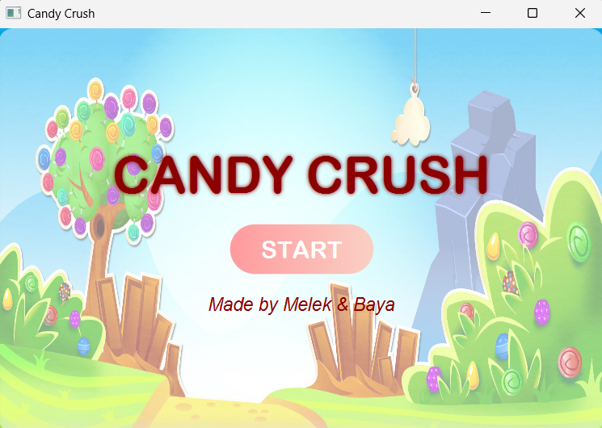
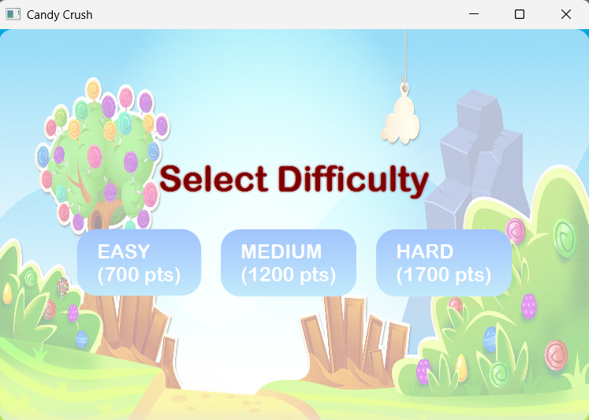
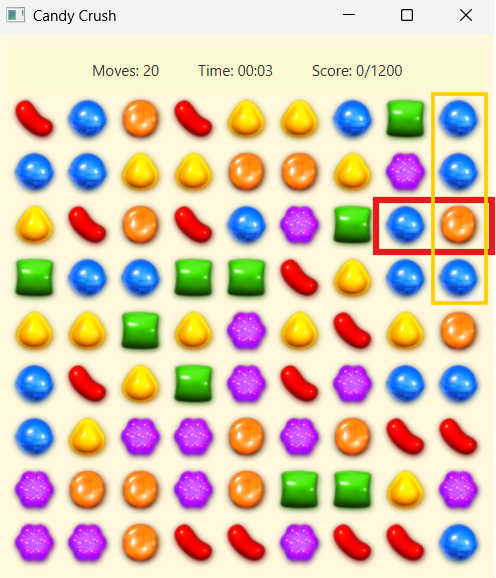
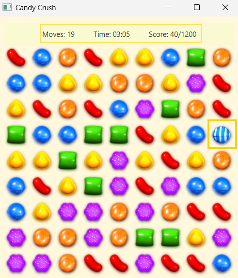

# 🍬 Candy-Crush

This project is a simplified clone of the popular game **Candy Crush**, developed in **Java**. It simulates the core mechanics of the original game including matching, scoring, special candies, and cascading effects, all presented through a graphical interface.

## 🎮 Game Overview

The player interacts with a 2D grid of candies and must match **three or more candies of the same type** by swapping adjacent ones. Only moves that result in valid combinations are allowed. The goal is to reach a target score within a limited number of moves.

## 🖼️ Visual Demo

The game begins with an intuitive starting menu, allowing users to initiate gameplay:

### 🟣 Figure 1: Starting Menu

  

---

Players choose their preferred difficulty level, directly impacting gameplay challenge and target score:

### 🔵 Figure 2: Difficulty Selection

  

---

Below are two screenshots demonstrating candy swapping and special candy generation:

### 🟠 Figures 3 & 4: Candy Swapping and Effects

  
  &nbsp;
  

<b>Figure 3:</b> Swap action initiated &nbsp;&nbsp;&nbsp;&nbsp; <b>Figure 4:</b> Striped candy generated and score updated

### 🧩 Match Types and Special Effects

- **3 candies** (line/column): simple match – candies disappear
- **4 candies**: creates a **striped candy** that clears a full row or column
- **5 candies in a T or L shape**: creates an **explosive candy** that clears a 3x3 area
- **5 candies in a straight line**: creates a **color bomb** that removes all candies of a certain type

## ✨ Features

- Object-oriented implementation of game logic
- Detection and handling of valid swaps and combinations
- Candy refill with cascading effects
- Generation and activation of special candies
- Score tracking and win/lose conditions
- Full **JavaFX-based GUI**

## 👨‍💻 Team
Student 1 – Baya Mezghani

Student 2 – Melek Kchaou 
